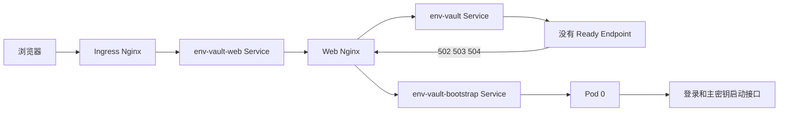
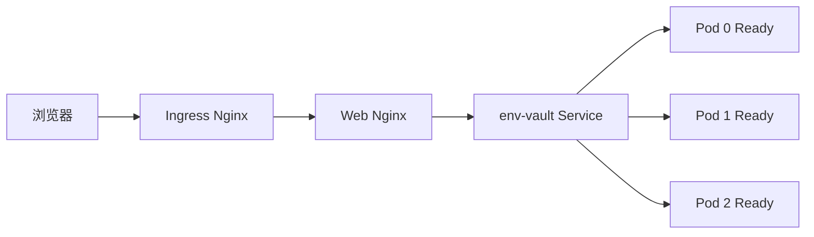
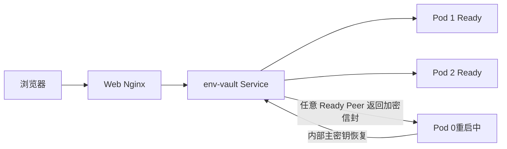
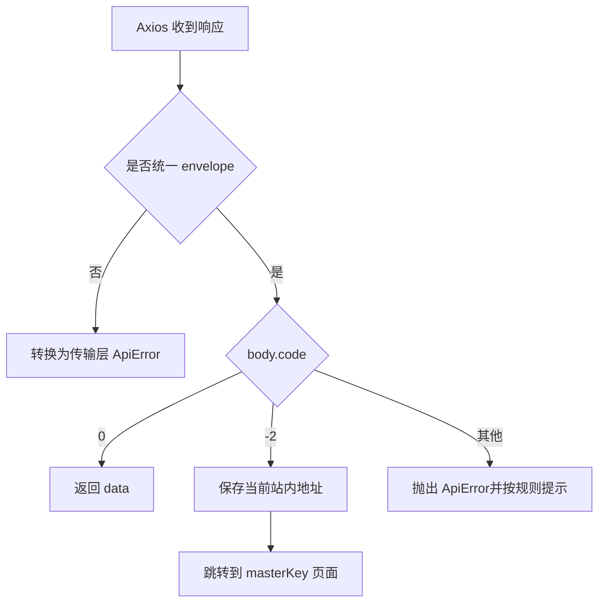

# EnvVault Web 前端架构设计

## 1. 背景与定位

EnvVault Web 是 EnvVault 密钥管理平台的前端工程。后端提供基于 HTTP 的组织 / 项目 / 环境 / Folder / Secret 管理能力,并配套 RBAC、审计、删除快照、Secret 版本历史和路径访问。前端负责把这些能力以安全、易用、可审计的方式呈现给用户。

本设计文档覆盖前端工程的所有架构层,包括目录结构、技术选型、模块划分、状态管理、API 抽象、权限模型、错误处理、构建脚本等。本期目标:

- 搭建可运行的基础脚手架(Vue 3 + TypeScript + Vite + Element Plus)。
- 沉淀面向后端 v6 模型的 API 抽象与 TypeScript 类型,作为后续业务页面的统一底盘。
- 暂不实现任何业务页面、任何业务 store、任何业务组件。

后续业务页面(组织/项目/环境/Folder/Secret/RBAC/审计)将在此骨架上按目录约定增量实现,不再讨论架构。

## 2. 技术选型

| 类别 | 选型 | 版本基线 | 选型理由 |
| --- | --- | --- | --- |
| 框架 | Vue | 3.4+ | 官方稳定版,`<script setup>` + Composition API 是默认写法 |
| 语言 | TypeScript | 5.4+ | 后端 DTO 全部强类型,前端必须端到端强类型 |
| 构建 | Vite | 5+ | 启动快,HMR 稳定,与 Vue 3 官方推荐一致 |
| 路由 | Vue Router | 4 | 官方方案,支持懒加载和导航守卫 |
| 状态 | Pinia | 2 | Vue 3 官方推荐,支持 composition 风格和 devtools |
| UI 库 | Element Plus | 2.7+ | 组件覆盖最全,Tree/Table/Cascader/Form 适合本业务,生态丰富 |
| 图标 | @element-plus/icons-vue | 与 UI 库对齐 | 配套图标,按需引入 |
| HTTP | Axios | 1.x | 拦截器链清晰,适合做统一响应/错误码映射 |
| 工具集 | @vueuse/core | 最新 | 复用常用 composables,避免重复造轮子 |
| 自动引入 | unplugin-auto-import + unplugin-vue-components | 最新 | Vue / Pinia / VueRouter / Element Plus 按需自动引入,减少样板 |
| 样式 | Sass | 最新 | Element Plus 主题覆盖 + 局部 scoped 样式 |
| 代码规范 | ESLint + Prettier | 最新 | flat config,Vue 3 + TS 规则集 |
| 测试 | Vitest + @vue/test-utils | 最新 | 与 Vite 同源,配置最简 |
| Node | ≥ 20 | LTS | Vite 5 要求 Node 18+,统一到 20 LTS |

明确不引入的依赖:

- 不引入 UI 库二次封装库(Element Plus 自身组件已足够)。
- 不引入状态持久化插件(Pinia 自带,敏感 token 走 httpOnly cookie 之外的方案由后端决定)。
- 不引入 CSS-in-JS,统一 Sass + Element Plus 主题变量。
- 不引入 d3 / echarts 等可视化,等业务真实需要时再选型。

## 3. 整体架构

### 3.1 Vue 应用分层

前端在数据流上保持单向,分层严格自上而下:

```text
view (pages)  ──►  composable  ──►  store (Pinia)  ──►  api (Axios)  ──►  HTTP
                  │                  │                 │
                  │                  │                 └─► 拦截器: token / 错误码 / loading
                  │                  └─► getters: 权限过滤后的派生数据
                  └─► view 局部状态(表单、抽屉、模态框)
```

要点:

- **API 层是唯一允许发 HTTP 请求的地方**。store 与 view 都通过 `api/*` 拿到数据,不直接使用 Axios。
- **store 是唯一允许缓存远端数据的地方**。view 拿数据必须从 store 读,view 内不做请求合并/缓存。
- **composable 是 view 复用逻辑的容器**,不持业务数据,只组合 store + 工具。
- **错误码统一在拦截器中转**,store 内只关心成功路径,失败由拦截器统一弹 toast 并抛出受控错误。
- **Secret 明文 value** 在前端只在用户主动 reveal 这一次进入内存,不做任何持久化,不做路由 state 缓存,不做 store 缓存。

### 3.2 部署组件与职责

生产部署中的“前端”不只有 Vue 页面。`env-vault-web` 容器同时运行 Web Nginx,由它提供静态文件并代理 `/api/**`。浏览器不直接访问 Go Pod。

| 组件 | 所在位置 | 职责 |
| --- | --- | --- |
| Vue 应用 | `env-vault-web` 容器的静态文件 | 页面渲染、路由守卫、状态管理和 API 调用 |
| Web Nginx | `env-vault-web` 容器 | 提供 Vue 静态文件,将 `/api/**` 优先代理到普通后端 Service,并处理启动回退 |
| Ingress Nginx | Kubernetes 集群入口 | 将外部 `/envvault/**` 去除前缀后转发到 `env-vault-web` Service |
| `env-vault-web` Service | Kubernetes | 将 Ingress 流量转发到 Web Nginx |
| `env-vault` Service | Kubernetes | 只选择已经加载主密钥且 readiness 通过的 Go Pod |
| `env-vault-bootstrap` Service | Kubernetes | 固定选择 Pod 0并包含 NotReady Pod,只作为 Web Nginx 的启动回退上游 |
| Go Pod 0/1/2 | 后端 StatefulSet | 提供认证、主密钥和普通业务接口 |

Web Nginx 的 API 代理规则定义在 `deploy/nginx.conf.template`:

```nginx
location /api/ {
    proxy_pass ${API_UPSTREAM};
    proxy_intercept_errors on;
    error_page 502 503 504 = @api_bootstrap;
}

location @api_bootstrap {
    proxy_method $request_method;
    proxy_pass ${API_BOOTSTRAP_UPSTREAM};
}
```

`API_UPSTREAM` 指向普通 `env-vault` Service,`API_BOOTSTRAP_UPSTREAM` 指向只选择 Pod 0的 `env-vault-bootstrap` Service。bootstrap Service 不由 Ingress 直接暴露。

当前示例清单部署三个 `env-vault-web` 副本,通过健康探针、跨节点分散和 PodDisruptionBudget 保证 Web Nginx 入口可用。Ingress Controller 是独立的集群入口组件,其副本数和高可用仍需要在 ingress-nginx 的 Helm values 或控制器清单中单独配置。

### 3.3 首次启动请求链路

首次启动时所有 Go Pod 都没有主密钥,因此普通 `env-vault` Service 没有 Ready Endpoint。Web Nginx 访问普通 Service 得到 502、503或504后,将原请求回退到 Pod 0。



该回退保证 `/pub/auth/login`、`/masterKey/status` 和 `/masterKey/share` 在普通 Service 为空时仍能访问,并保证三份分片始终提交到同一个 Pod 0。普通业务接口到达 Pod 0后仍会被后端 Ready 中间件阻止,返回 HTTP 200和业务码 `-2`。

### 3.4 正常运行请求链路

主密钥加载后,Pod 0、1、2按各自 readiness 状态进入普通 Service。包括 `/masterKey/status` 在内的所有外部 API 都由普通 Service 分发,不会固定依赖 Pod 0。



### 3.5 Pod 0重启链路

Pod 0重启时,Pod 1和 Pod 2仍在普通 Service 中。浏览器状态检查和业务请求继续由 Pod 1或 Pod 2处理,Web Nginx 不触发 bootstrap 回退。Pod 0启动后通过后端内部 Peer 恢复链路获取主密钥,Ready 后重新加入普通 Service。



只有普通 Service 没有任何 Ready Endpoint 时 Web Nginx 才使用 bootstrap Service。如果此时 Pod 0也不可访问,请求会保留为传输层 502、503或504,不会伪装成业务码 `-2`。

### 3.6 Gateway拆分预留

当前 Web Nginx与 Vue静态文件位于同一个 `env-vault-web` 镜像。Web Pod不等待 bootstrap或 Pod 0启动:Pod 0暂不可用时仍可提供登录和等待页面,API回退在 bootstrap恢复后自动可用。bootstrap使用稳定 ClusterIP,因此 Pod 0重建和 Pod IP变化不要求 Web Nginx重新解析 Pod地址。

未来只有在 API代理需要独立扩容、独立发布或由单独组件维护时才拆分 `env-vault-gateway`。拆分后的职责如下:

```text
Ingress
├── /envvault/api/** -> env-vault-gateway -> env-vault Service
│                                        -> env-vault-bootstrap 回退
└── /envvault/**     -> env-vault-web     -> Vue静态文件
```

`env-vault-gateway` 必须继续承担 502、503、504启动回退,保持 `code=-2` 处理语义,并按 Web入口标准配置三副本、健康探针、跨节点分布和 PodDisruptionBudget。前端与 Gateway继续使用同一域名,避免引入额外 CORS和认证配置。

## 4. 目录结构

```text
env-vault-web/
├── .editorconfig
├── .env.development
├── .env.production
├── .eslintrc / eslint.config.ts
├── .prettierrc.json
├── .gitignore
├── index.html
├── package.json
├── pnpm-lock.yaml
├── README.md
├── tsconfig.json
├── tsconfig.node.json
├── vite.config.ts
└── src/
    ├── api/
    │   ├── http.ts                  # Axios 实例 + 拦截器
    │   ├── error-code.ts            # 业务错误码常量
    │   ├── auth.ts                  # /api/v1/auth/dev/token 等
    │   ├── me.ts                    # /api/v1/me
    │   ├── organization.ts          # /api/v1/org/*
    │   ├── project.ts               # /api/v1/project/*
    │   ├── environment.ts           # /api/v1/env/* + template/*
    │   ├── folder.ts                # /api/v1/folder/*
    │   ├── secret.ts                # /api/v1/secret/* + path/*
    │   ├── audit.ts                 # /api/v1/audit/*
    │   ├── rbac.ts                  # 角色 / 用户 / 授权(后续)
    │   └── index.ts                 # 聚合导出
    ├── assets/
    │   └── styles/
    │       ├── index.scss
    │       ├── element-overrides.scss
    │       └── reset.scss
    ├── components/
    │   ├── common/                  # 通用展示组件(PageHeader/EmptyState/ErrorState)
    │   ├── form/                    # 通用表单组件(后续)
    │   └── business/                # 业务组件(本期空)
    ├── composables/
    │   ├── use-pagination.ts        # 通用分页
    │   ├── use-table-fetch.ts       # 通用表格 + 远端分页
    │   ├── use-permission.ts        # 当前用户权限判断
    │   ├── use-loading.ts           # 全局 / 局部 loading
    │   └── use-secret-path.ts       # Secret 路径解析 / 拼接
    ├── constants/
    │   ├── error-code.ts            # 与后端对齐的业务 code
    │   ├── permission.ts            # 权限码常量(secret:read 等)
    │   ├── role.ts                  # 角色常量(org_admin 等)
    │   └── resource-type.ts         # resourceType 枚举
    ├── layouts/
    │   ├── DefaultLayout.vue        # 含侧边栏 + 顶部栏
    │   └── AuthLayout.vue           # 登录 / 无认证态布局
    ├── plugins/
    │   ├── element-plus.ts          # Element Plus + 按需引入
    │   └── pinia.ts                 # Pinia 安装
    ├── router/
    │   ├── index.ts                 # 路由表 + 守卫
    │   ├── routes.ts                # 路由声明
    │   └── guards.ts                # 鉴权 / 权限守卫
    ├── stores/
    │   ├── auth.ts                  # 当前登录态、token、当前用户
    │   ├── organization.ts          # 当前 org 列表 + 选中
    │   ├── project.ts               # 当前 project 列表 + 选中
    │   ├── environment.ts           # env 列表 + 选中
    │   ├── folder.ts                # folder 列表 + 选中
    │   ├── secret.ts                # secret 列表 + 搜索
    │   ├── audit.ts                 # 审计查询
    │   ├── rbac.ts                  # 角色 / 用户 / 授权(后续)
    │   └── index.ts                 # 聚合导出
    ├── types/
    │   ├── api.ts                   # 统一响应、分页、错误类型
    │   ├── organization.ts
    │   ├── project.ts
    │   ├── environment.ts
    │   ├── folder.ts
    │   ├── secret.ts
    │   ├── audit.ts
    │   ├── user.ts
    │   ├── rbac.ts
    │   └── path.ts                  # Secret 路径解析类型
    ├── utils/
    │   ├── format.ts                # 时间、字节、密钥遮显
    │   ├── copy.ts                  # 复制到剪贴板
    │   ├── url.ts                   # 路径拼接 / query 序列化
    │   ├── storage.ts               # localStorage / sessionStorage 抽象
    │   └── crypto.ts                # 前端可视化遮显(非加密,仅 UI 用)
    ├── views/
    │   ├── auth/
    │   │   └── LoginView.vue        # 占位
    │   ├── dashboard/
    │   │   └── DashboardView.vue    # 占位
    │   ├── organization/
    │   │   └── OrganizationListView.vue
    │   ├── project/
    │   │   └── ProjectListView.vue
    │   ├── env/
    │   │   └── EnvListView.vue
    │   ├── folder/
    │   │   └── FolderListView.vue
    │   ├── secret/
    │   │   └── SecretListView.vue
    │   ├── audit/                   # 后续
    │   ├── rbac/                    # 后续
    │   └── error/
    │       ├── ForbiddenView.vue
    │       └── NotFoundView.vue
    ├── App.vue
    ├── main.ts
    └── env.d.ts
```

目录约束:

- `api/` 内每个文件只导出 `request*` 命名空间的纯函数,函数签名只依赖 `types/`,不依赖 `stores/`。
- `stores/` 内的 store 通过 `api/*` 拿数据,所有远端同步动作都集中在 store 的 actions。
- `views/` 内的页面仅依赖 `stores/` 和 `composables/`,不直接 import `api/`。
- `components/business/` 业务组件可被 view 复用,允许依赖 store。
- `components/common/` 通用组件不允许依赖 store。

## 5. 路由设计

### 5.1 路由结构

路由按业务实体层级 + 功能模块组合,所有需要登录的页面挂在 `/app` 之下,登录页独立。

```text
/                            重定向到 /app/dashboard
/login                       登录(开发态: dev token 签发;生产: 外部 IdP 跳转)
/masterKey                   系统启动阶段的受认证等待与分片输入页
/app
  /dashboard                 首页(欢迎 + 快捷入口)
  /orgs                      组织列表
  /orgs/:orgId               组织详情(默认重定向到 projects)
  /orgs/:orgId/projects      项目列表
  /orgs/:orgId/projects/:projectId       项目详情(默认重定向到 envs)
  /orgs/:orgId/projects/:projectId/envs  环境列表
  /orgs/:orgId/projects/:projectId/envs/:envId                          环境详情(默认重定向到 folders)
  /orgs/:orgId/projects/:projectId/envs/:envId/folders                  folder 列表
  /orgs/:orgId/projects/:projectId/envs/:envId/folders/:folderId        folder 详情(默认重定向到 secrets)
  /orgs/:orgId/projects/:projectId/envs/:envId/folders/:folderId/secrets  secret 列表
  /secrets/path/:encodedPath            路径访问 secret(URL 段,见 §11)
  /audit                                  审计查询
  /rbac/roles                            角色管理
  /rbac/users                            用户管理
  /rbac/grants                           授权管理
  /me                                    当前用户
/forbidden                              403
/:pathMatch(.*)*                        404
```

### 5.2 路由声明原则

- 路由 name 使用 kebab-case 字符串,首字母大写,例如 `OrgProjectList`。
- 路由 path 中路径参数使用 `:orgId` / `:projectId` / `:envId` / `:folderId` / `:encodedPath`,与后端响应字段一致(camelCase)。
- `/masterKey` 本身使用 `meta.requiresAuth = true`;所有 `/app/**` 业务路由同样要求登录,只有 `/login` 等明确公开路由不要求 token。
- 需要特定权限的路由通过 `meta.permissions: ['secret:reveal']` 标记,权限守卫校验。
- 路由懒加载使用动态 import。
- 详情页默认重定向到第一个 tab,例如 `OrgDetail` 重定向到 `orgs/:orgId/projects`。

### 5.3 守卫

`router/guards.ts` 按以下顺序处理导航:

1. 已登录用户访问 `/login` 时进入组织管理页面
2. `meta.requiresAuth` 命中但本地没有 token 时跳转 `/login`,并保留 `redirect` query
3. `meta.requiresMasterKey` 命中时读取 `useMasterKeyStore` 中的状态快照,没有快照才调用 `/masterKey/status`
4. 状态明确为 `ready=false` 时跳转 `/masterKey`,并保留原目标地址
5. 状态接口发生网络或网关错误时采用失败关闭策略,同样进入 `/masterKey` 的错误重试页面
6. 导航完成后根据 `meta.title` 更新 `document.title`

路由守卫的状态检查与 Axios 对 `code=-2` 的处理互为补充。守卫用于页面进入前的主动检查；Axios 拦截器用于已经进入业务页面后,任意接口发现系统未就绪时统一跳转。正常运行时 `/masterKey/status` 通过普通 `env-vault` Service 访问任意 Ready Pod,不能固定转发到 Pod 0。

## 6. 状态管理

按业务实体拆分 store,而不是按页面拆。store 之间允许单向引用:`project` 可以读 `organization` 里的当前选中 org,但反过来不行。

| Store | 主要 state | 主要 actions | 主要 getters |
| --- | --- | --- | --- |
| `useAuthStore` | `token`、`currentUser` | `login`、`logout`、`refreshMe` | `isAuthenticated`、`roles` |
| `useOrganizationStore` | `list`、`currentOrgId` | `fetchList`、`setCurrent` | `current` |
| `useProjectStore` | `listByOrg`、`currentProjectId` | `fetchList(orgId)`、`setCurrent` | `current` |
| `useEnvironmentStore` | `listByProject`、`currentEnvId` | `fetchList(projectId)`、`fetchTemplates(orgId)` | `current`、`templatesByOrg` |
| `useFolderStore` | `listByEnv`、`currentFolderId` | `fetchList(envId)` | `current` |
| `useSecretStore` | `listByFolder`、`keyword`、`page` | `fetchList(folderId)`、`search`、`reveal` | `currentList` |
| `useAuditStore` | `filter`、`page` | `fetchList` | `records` |
| `useRbacStore` | `roles`、`users`、`grants` | `fetchRoles`、`fetchUsers`、`fetchGrants`、`grant`、`revoke` | `effectivePermissions` |

约束:

- `useAuthStore` 是唯一能直接操作 `localStorage` 中 token 字段的 store。其它 store 禁止读写 token。
- `useSecretStore` 内**不缓存明文 value**。`reveal(id)` 返回明文后,view 持有局部变量,关弹窗即释放。
- 列表数据使用按父实体 ID 分桶的 `Map<parentId, Entity[]>`,避免来回切换时重复请求。
- 列表请求不允许在 view 内直接发,必须经 `store.action` 包装,以便统一处理 loading / 错误 / 缓存。
- 任何 store 不允许在 `setup` 顶层 await 数据,初始化仅做"已登录就拉一次当前用户"。

## 7. API 层

### 7.1 Axios 实例

`api/http.ts` 创建单一实例:

- `baseURL`:从 `import.meta.env.VITE_API_BASE` 读取,默认 `/api/v1`。
- `timeout`: 30s,Secret 写入可单独覆盖。
- `headers`: `Content-Type: application/json`、`x-request-id` 由拦截器补 UUID。
- 拦截器链:
  1. **请求拦截**:从 `useAuthStore` 读 `token`,如有则注入 `Authorization: Bearer <token>`。统一补 `x-request-id`。
  2. **响应拦截**(统一 envelope 流程,详见 §7.4):
     - 应用内所有 HTTP 响应体都是 `{code, msg, data}` envelope,与 HTTP 状态码无关。
     - `code: 0` → 业务成功,剥到 `data.data` 后返回;`list: null` 会被归一为 `[]`。
     - `code: -2` → 系统主密钥未就绪,保留当前地址并跳转到 `/masterKey`。
     - `code: 其他` → 业务失败,统一抛 `ApiError`,文案取 `data.msg`(已对用户可读)。
     - 非 envelope 响应(网络断开 / nginx 5xx / 网关错误)→ 统一兜底为 `ApiError`,`code: -1`。
- 系统启动码 `-2` 和认证失败码在 `api/http.ts` 集中处理,其他业务错误不按具体码做差异化 UI 跳转。
- 后续增加特殊错误码处理时继续集中放在请求基础设施层,**不要散落到 view**。

### 7.2 API 函数风格

每个 `api/<resource>.ts` 暴露纯函数,参数对象使用 TypeScript 接口,严格匹配后端 DTO:

```ts
// 风格示例,本期仅占位,不实现
export function listOrganizations(req: PageRequest): Promise<PageResp<Organization>> {
  return http.post<PageResp<Organization>>('/org/list', req)
}
```

约束:

- 函数命名 `listXxx` / `createXxx` / `infoXxx` / `updateXxx` / `deleteXxx` / `revealXxx`,与后端路径动词对齐。
- 请求体命名严格使用后端 camelCase 字段(`orgId` / `parentId` / `resourceId` 等)。
- 列表类接口统一返回 `PageResp<T>`,与后端 `{ pageNum, pageSize, total, list }` 一致。
- 详情类接口返回单实体,例如 `Promise<Organization>`。
- 错误处理不在 api 层 throw 业务异常,统一在拦截器中 reject 一个 `ApiError`,调用方可用 `instanceof ApiError` + `code` 判定。

### 7.3 错误类型

```ts
// types/api.ts
export class ApiError extends Error {
  readonly code: number
  readonly httpStatus: number
  readonly requestId?: string
  constructor(opts: { code: number; httpStatus: number; msg: string; requestId?: string }) { ... }
}
```

`ApiError` 是拦截器抛出的唯一错误类型;`message` 直接来自后端 `msg`(已对用户可读)。调用方用 `e instanceof ApiError ? e.message : '兜底文案'` 取文案。

### 7.4 统一响应协议与特殊状态码

**所有 `/api/v1/*` 接口的 HTTP 响应体都是 `{code, msg, data}` envelope,与 HTTP 状态码无关**。前端识别以下情况:

| body.code | 含义 | 拦截器处理 | 调用方见到 |
| --- | --- | --- | --- |
| `0` | 业务成功 | 返回 `data.data`;`list: null` 归一为 `list: []` | 直接拿到的就是 `data` |
| `-2` | 系统主密钥未就绪 | 不弹 toast,保留当前地址并跳转 `/masterKey` | 抛出 `ApiError`,页面通常已开始跳转 |
| 其他 | 业务失败 | 抛 `ApiError`,`message` 取 `data.msg` | catch 后展示 `e.message` |

`-2` 是启动阶段专用业务码,不是 HTTP 503的别名。后端仅在主密钥未就绪且请求不在启动白名单时返回以下响应:

```json
{
  "code": -2,
  "msg": "系统启动中",
  "data": null
}
```



HTTP 502、503、504表示 Ingress、Web Nginx 或 Service 当前没有可用连接,属于传输层错误。它们先由 Web Nginx尝试回退 bootstrap；回退仍失败时,Axios 才将其转换为 `code=-1` 的 `ApiError`。前端不得根据 HTTP 503直接判断主密钥未加载。

错误码的完整常量表见 `constants/error-code.ts`。当前只有 `-2` 和认证失败具有集中式导航行为,其他非 0业务码统一抛出 `ApiError` 并展示 `msg`。后续特殊处理继续集中放在 `api/http.ts`,不得散落到 view。

应用内 envelope 之外的两类兜底:

- **2xx 但 body 不是 envelope**:协议异常,统一抛 `ApiError`,`code: -1`,`msg: '服务器返回了非预期格式'`。
- **网络断开 / nginx 5xx / 网关错误**(无 envelope):统一抛 `ApiError`,`code: -1`,`msg` 取 axios 的 `error.message` 兜底(`'网络异常,请稍后重试'`)。

约定:

- **成功响应**:`code: 0` 时 `data` 是真实载荷,`msg` 通常为空串,前端不读取。
- **失败响应**:`code !== 0` 时 `data` 通常为 `null`,展示给用户的文案就是 `data.msg`。
- **静默失败**:请求配置 `silent: true` 时跳过全局 toast(给启动期 `refreshMe` / 静默轮询等场景使用)。

## 8. TypeScript 类型系统

### 8.1 总原则

- 所有 API DTO、路由参数、store state 全部显式标注,禁用 `any`。
- 公共枚举使用 `as const` + 联合字面量,例如 `export const ResourceType = { Organization: 'organization', Project: 'project', ... } as const`,联合类型 `type ResourceType = (typeof ResourceType)[keyof typeof ResourceType]`。
- 时间字段统一使用 `string` (ISO 8601),不引入 `Date` 对象,避免序列化歧义。
- UUID 字段使用 `type Uuid = string` 命名别名,提升可读性。
- 后端 `code: 0` 成功 / `code: -1` 通用失败,本前端在拦截器层归一化,不进入业务代码。

### 8.2 核心类型骨架

```ts
// types/api.ts
export interface ApiResponse<T> { code: number; msg: string; data: T }
export interface PageRequest { pageNum?: number; pageSize?: number }
export interface PageResp<T> { pageNum: number; pageSize: number; total: number; list: T[] }

// types/organization.ts
export interface Organization {
  id: Uuid
  code: string
  name: string
  comment: string
  createdBy: string
  createdByLabel: string
  updatedBy: string
  updatedByLabel: string
  createdAt: string
  updatedAt: string
}

// types/secret.ts
export interface SecretMeta {
  id: Uuid
  folderId: Uuid
  key: string
  comment: string
  version: number
  createdBy: string
  createdByLabel: string
  updatedBy: string
  updatedByLabel: string
  createdAt: string
  updatedAt: string
  // 注意:不包含 value 字段,符合后端列表不返回明文约定
}
export interface SecretReveal { id: Uuid; value: string; version: number }

// types/path.ts
export interface ParsedSecretPath {
  orgCode: string
  projectCode: string
  envCode: string
  folderCode: string
  key: string
}
```

### 8.3 命名约束

- 接口 `interface`,运行时数据 `type`。
- 业务模型用名词,DTO 用 `XxxRequest` / `XxxResponse` / `XxxInfo` / `XxxListResp`。
- 不要在后端 camelCase 之上做二次转换,直接原样使用。

## 9. RBAC 与权限控制

### 9.1 模型映射

后端 `domain / API` 字段使用 `userId` / `roleType` / `resourceType` / `resourceId`,前端统一沿用。前端不感知 `scope_type` / `scope_id` / `role_code` 等内部命名。

| 内部表/字段 | 前端类型字段 |
| --- | --- |
| `users.external_user_id` | `User.userId` |
| `roles.code` | `Role.roleType` (`org_admin` / `project_admin` / `project_viewer` / `project_developer` 等) |
| `user_role_bindings.scope_type` | `RoleGrant.resourceType` |
| `user_role_bindings.scope_id` | `RoleGrant.resourceId` |

### 9.2 权限码常量

`constants/permission.ts` 内集中维护权限码,例如 `secret:read` / `secret:reveal` / `org:force_delete` / `env_template:read` 等。前端写权限判断时**必须从常量引用**,不允许散落字符串。

### 9.3 权限判断

`composables/use-permission.ts` 提供:

- `has(permission)`:判断当前用户是否拥有某权限码,基于当前用户授权列表(在 `useAuthStore.currentUser` 解析后的扁平结构上做匹配)。
- `hasAll(perms)` / `hasAny(perms)`:批量判断。
- `canReveal(secret)`:快捷方法,封装 `secret:reveal`。
- `canDeleteResource(resourceType, resourceId)`:封装"非空父资源删除需要 force"等业务规则(后续业务实现时落)。

权限判断在前端只是 UI 控制,所有写操作仍由后端 RBAC 二次拦截,前端隐藏按钮不等于安全。

## 10. 统一响应与错误处理

### 10.1 处理原则

- 拦截器已经把所有 `code !== 0` 归一为 `ApiError`,业务代码只需要 `try { ... } catch (e) { ElMessage.error(e instanceof ApiError ? e.message : '兜底') }`。
- `code=-2` 由 `api/http.ts` 集中保存当前地址并跳转 `/masterKey`,HTTP 401或认证业务码由同一拦截器清理 token 并跳转 `/login`。
- 除上述全局导航行为外,业务 view 不基于具体错误码分支,普通非 0码统一展示后端 `msg`。
- 错误码常量在 `constants/error-code.ts` 内集中维护。后续如需新的差异化处理,继续在 `api/http.ts` 集中扩展。

### 10.2 列表分页约定(基于 `total` 的归一)

后端约定分页接口 `PageResp<T>` 在 `total: 0` 时 `list` 字段为 `[]`。store / view 端按以下规则取值:

```ts
// stores/<resource>.ts — fetchList
const resp = await withApiCall(() => listXxx(merged))
// 业务上 total>0 才有数据;list 为 null 时兜底为 []
items.value = (resp.total > 0 ? resp.list : null) ?? []
total.value = resp.total
```

判读流程:

1. **先看 `total`**:`total > 0` 才认为有数据可展示;`total === 0` 直接当作空集合。
2. **`list` 兜底**:如果 `list` 是 `null`(后端历史路径上会下发),用 `[]` 兜底,避免下游 `.map()` / `.length` 抛 `TypeError`。
3. 拦截器在协议层也会做一次 `list: null → list: []` 的归一,store 层的判断是**业务层兜底**,两者不冲突。

绕开 store 直接调 `listXxx` 的 view(如 `FolderListView`)也按相同规则处理。

### 10.3 UI 行为

- 全局只有一个 `ElMessage` 出口,封装在 `utils/notify.ts`,所有 store / view 通过 `notify.error(msg)` 调用,避免到处 import Element Plus。
- 列表加载失败展示 `ErrorState` 组件,提供"重试"按钮,点击重新调 `store.action`。
- 表单提交失败:后端下发的 `msg` 直接展示给用户(已对用户可读);字段级错误(`code: 1002` 且 `data` 含字段错误)由调用方按需映射到 Element Plus Form field error。
- 空列表不视为错误:任何 `total === 0` / `items.length === 0` 都展示空态,不再触发 toast。
- 跳转登录由路由守卫统一处理(token 不存在 / 路由标记 `requiresAuth` 但未登录),不依赖后端 1401 通知。

## 11. Secret 路径访问

后端 v5 起支持 `org_code.project_code.env_code.folder_code.KEY` 五段式路径。前端做对应支持:

### 11.1 URL 设计

- 普通浏览:走实体层级路由 `/orgs/:orgId/projects/.../secrets`。
- 直链/分享:用 `encodedPath` 段,例如 `/secrets/path/o1.p1.dev.globals.DATABASE_URL`。前端 `encodeURIComponent` 后拼到 URL。
- 路径解析在 `composables/use-secret-path.ts` 内,做 5 段校验、code 风格校验(小写中横线 / 大写下划线),失败抛 `InvalidSecretPathError`。

### 11.2 UI 行为

- Secret 详情页右上角提供"复制路径"按钮,产物是 `orgCode.projectCode.envCode.folderCode.KEY`,不是 URL。
- 路径输入框(全局搜索的快捷跳转)支持粘贴路径,实时解析预览。
- 路径访问页(`/secrets/path/:encodedPath`)在加载完成后,如果当前路由来源是 secret 列表,提供"返回列表"按钮,否则提供"返回首页"。

## 12. UI 与交互

- 布局统一为 `DefaultLayout`:左侧 collapsible 侧边栏(组织/项目树)+ 顶部栏(用户、切换 org)+ 内容区。
- 主体表格统一用 `ElTable`,列定义集中在 `views/<module>/columns.ts`(本期不实现,先约定位置)。
- 详情页统一为 `ElTabs`:`Overview` / `Members` / `Audit` / `Settings` 四个 tab。Tab 由路由子级切换,刷新可保持。
- 暗色主题:Element Plus 主题变量覆盖 + 命名空间 `html.dark`,主题切换通过 `useTheme` composable 切换 `data-theme`。
- 全屏加载使用 `ElLoading.service`,局部加载使用按钮 `loading` 属性。
- 所有弹窗统一 `ElDialog` + `append-to-body`,避免嵌套滚动问题。
- 业务弹框外层统一使用 `16px` 圆角(`--v-radius-dialog`)、`1px` surface 边框和 `--v-shadow-lg`;header 高度为 `56px`,footer 使用顶部边线与 `14px 22px` 内边距。
- 弹框底部“取消 / 确认”按钮统一为 `32px` 高、最小宽度 `58px`、水平内边距 `16px`、`16px` 圆角(`--v-radius-dialog-action`),按钮间距 `10px`;普通确认使用主色蓝,删除等危险确认使用 danger 红色。
- `ElMessageBox.confirm` 必须传 `customClass: 'vault-confirm-message-box'`;危险操作同时传 `confirmButtonClass: 'vault-delete-confirm-button'`,不得在业务页面重复定义确认框壳体与按钮样式。
- 复制成功使用 `ElMessage.success('已复制')`,不允许 toast 滥用。
- **Secret 明文展示**:使用 `ElDialog` + `ElInput(type=textarea, readonly)`,关闭时清空本地变量,且按钮触发后才调 `reveal`,不做进入页面自动拉明文。

### 页面导航记忆

- 当前标签页使用 `sessionStorage` 保存导航位置，刷新页面或切换菜单后返回时恢复
- 密钥管理保存组织、项目、Folder、groups 二级目录及目录分页和筛选条件；组织管理保存租户、组织、项目层级及分页和筛选条件
- 项目列表、项目详情目录和详情 Tab、环境管理的组织与项目、用户管理的租户、个人中心 Tab 同样支持恢复
- 地址中明确指定的项目或组织优先于浏览器记忆，恢复目录前重新查询接口；已删除或无权访问的位置回退到可用的上级列表
- 仅保存导航标识和选项，不保存 Secret 值、Token 明文、编辑内容或明文可见状态；登录新账号和退出登录时清理导航记忆
- 刷新图标位于各页面内容操作栏最右侧，与搜索、新增等按钮同一行；复用当前页面查询方法，仅刷新当前层级的数据，保留项目、目录、分页和筛选条件，加载时旋转并禁止重复点击
- 公共实现位于 `src/composables/use-navigation-memory.ts`，页面显式声明可保存的字段，异步恢复期间暂停写入

## 13. 安全实践

- 严禁把 Secret 明文 value 写入 store 持久化数据、localStorage、URL query、history state、浏览器 console。
- 严禁把明文 value 出现在错误信息中(API 拦截器在打 toast 时已统一用后端 `msg`,本端不再做拼接)。
- Token 优先走 httpOnly cookie + 后端控制(由后端决定)。如果本期使用 `localStorage`,需要在 README 标注迁移计划。
- 前端所有跳转链接不直接放 `target=_blank` 到外部域名。如必须外跳,使用 `noopener noreferrer`。
- 生产构建默认开启 Vite 的 `build.sourcemap = 'hidden'`,源代码不暴露给生产用户。

## 14. 构建与脚本

### 14.1 package.json scripts

```jsonc
{
  "scripts": {
    "dev": "vite",
    "build": "vue-tsc --noEmit && vite build",
    "preview": "vite preview --port 4173",
    "typecheck": "vue-tsc --noEmit",
    "lint": "eslint . --cache",
    "lint:fix": "eslint . --cache --fix",
    "format": "prettier --write .",
    "test": "vitest run",
    "test:watch": "vitest"
  }
}
```

### 14.2 环境变量

`.env.development`:

```dotenv
VITE_API_BASE=/api/v1
VITE_APP_TITLE=EnvVault Dev
```

`.env.production`:

```dotenv
VITE_API_BASE=/api/v1
VITE_APP_TITLE=EnvVault
```

> 真上线时 `VITE_API_BASE` 需要根据反代/网关决定,本期固定 `/api/v1`,与后端统一前缀一致。

## 15. 测试策略

- 单元测试覆盖 `utils/` 纯函数和 `composables/` 内不依赖 store 的逻辑(例如 `use-secret-path` 的解析/校验)。
- 组件测试以 `composables + Element Plus` 行为为主,UI 视觉测试不进单元测试。
- 端到端测试(Playwright)本期不引入,等业务页面稳定后单独建仓。
- `pnpm test` 跑全部 Vitest,`pnpm test:watch` 写代码时实时跑。
- CI 阶段至少跑 `typecheck + lint + test`,不跑 build(留到 release 流水线)。

## 16. 代码规范

- ESLint flat config,启用 `eslint:recommended` + `typescript-eslint` 推荐 + `vue-eslint-parser` + `eslint-plugin-vue` 推荐的 Vue 3 规则集。
- Prettier 统一缩进 2 空格、单引号、尾分号、行宽 100。
- 提交前由 `lint-staged` + `simple-git-hooks` 跑 `eslint --fix` + `prettier --write`(本期仅配置,不强制开 hook)。
- 文件命名:
  - 组件:`PascalCase.vue`。
  - 工具 / composable / store / api:`kebab-case.ts`。
  - 类型文件:`kebab-case.ts`,导出 `PascalCase` 接口。
- 禁用 `any`,需要逃生口时用 `unknown` + 显式 narrow。
- Vue 文件 `<script setup lang="ts">` 强制 `name` 通过 `defineOptions({ name: 'Xxx' })` 声明(开发体验插件依赖)。

## 17. 与后端的对接约定

| 维度 | 后端 | 前端 |
| --- | --- | --- |
| API 前缀 | `/api/v1` | `VITE_API_BASE = /api/v1` |
| 字段命名 | camelCase | camelCase,直接使用 |
| 列表分页 | `{ pageNum, pageSize, total, list }`,空页 `list` 可能为 `null` | `PageResp<T>` 一一对应,store / view 按 `(total > 0 ? list : null) ?? []` 取值 |
| 统一响应 | `{ code, msg, data }`(所有 HTTP 响应都是 envelope) | 拦截器剥到 `data.data`,业务只见到 `data` |
| 错误模型 | 统一 envelope和集中式特殊码处理 | `code: 0` 成功;其他均抛 `ApiError`;`-2` 和认证失败附带全局导航行为 |
| 业务 code | `0` 成功,`-1` 业务通用失败,`-2` 系统启动中;`1002/1401/1403/1404/1409/1500/1503` 已知码 | `constants/error-code.ts` 内集中常量;`-2` 统一跳转主密钥页面 |
| 鉴权失败 | `code: 1401` 或 HTTP 401 | 路由守卫统一处理(token 不存在 / 过期 → 跳 `/login`) |
| 非 envelope 错误 | 网络断开 / nginx 5xx / 网关 | 拦截器兜底为 `ApiError`,`code: -1`,`msg` 取 axios error |
| Secret 列表 | 不返回明文 | `SecretMeta` 不含 `value` 字段 |
| Secret 明文 | `/secret/reveal` 与 `/secret/path/reveal` | `useSecretStore.reveal(id)` / `revealByPath(path)`,仅弹窗内持有 |
| 审计 | `action` 枚举 | 前端仅做展示,不做触发 |
| 请求 ID | `x-request-id` | 拦截器自动注入 UUID,后端透传回响应头,前端报错时上报 |
| RBAC | `userId` / `roleType` / `resourceType` / `resourceId` | 同名同语义,前端不感知内部 `scope_*` 命名 |
| 路径访问 | 5 段式 `o.p.e.f.K` | `composables/use-secret-path` 解析,URL 段 `encodedPath` 兜底直链 |
| 登录 | dev token / 外部 IdP | 本期仅 dev token,登录页调 `/api/v1/auth/dev/token` |

## 18. 后续扩展

下列能力在本期脚手架中**不实现**,但目录、命名、抽象已为它们预留:

- Secret 版本历史(`secret_versions`)、回滚、版本 diff 展示。
- 删除记录查询(`deleted_records`)、恢复 UI(后端恢复接口出现后)。
- RBAC 管理页面(角色 / 用户 / 授权矩阵可视化),基于 `useRbacStore`。
- 全局审计看板(按资源 / 时间 / 用户聚合),基于 `useAuditStore`。
- 多语言(`@vueuse/core` 已支持,语言包结构放在 `locales/`,预留不引入 i18n 库)。
- 暗色主题细节打磨。
- K8s Operator / CLI 的 SDK 文档站点(由 docs 仓独立,本仓不涉及)。

## 19. 快速开始

```bash
# 安装依赖
pnpm install

# 本地开发(默认走 vite proxy 把 /api/v1 转发到后端 http://localhost:8090)
pnpm dev

# 类型检查
pnpm typecheck

# 构建生产产物
pnpm build

# 本地预览构建产物
pnpm preview
```

本期不实现任何业务页面,`pnpm dev` 启动后默认落在 `/app/dashboard` 占位页。`/login` 提供 dev token 签发入口,便于联调后端。

---

> 文档版本: v1
> 适用后端版本: EnvVault v6(对应 SecretService + RBACService 授权下沉,Org/Project/Env/EnvTpl/Folder/Secret CRUD/Audit 授权保留 controller)
> 维护者: 前端架构组
