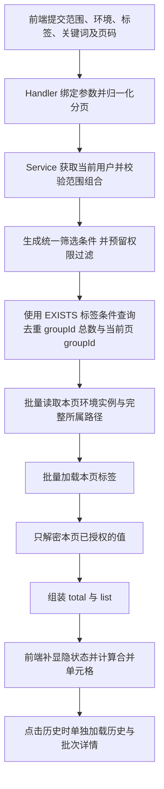

# 秘钥检索设计草案

状态：Key、备注和标签筛选已接入独立后端 search 模块，合并表格、分页和历史查询可使用真实接口；统一权限接入待开发

后端实现说明与部署索引位于 env-vault 仓库 `design/secret-search.md`、`design/database.md`，OpenAPI 为 `design/secret-search-openapi.yaml`
当前共享密钥查询仍以认证为边界，资源及环境权限过滤是明确待办，下面的“可访问范围”是权限接入目标，不表示本阶段已实现完整授权

## 范围与环境

范围按租户 > 组织 > 项目 > 文件夹逐级展开，每一级均可勾选，支持不同租户、组织、项目和文件夹的多范围复选

| 选中范围                 | 环境条件               | 查询范围                                 |
| ------------------------ | ---------------------- | ---------------------------------------- |
| 无                       | 不展示                 | 当前用户有权访问的全部范围、全部环境     |
| 租户                     | 不展示                 | 当前租户及其下级的全部可访问环境         |
| 组织                     | 不展示                 | 当前组织及其下级的全部可访问环境         |
| 项目                     | 展示复选框             | 当前项目，默认选排序最前的环境           |
| 文件夹                   | 保留所属项目环境复选框 | 当前逻辑目录及下级，按所选环境过滤       |
| 同一项目的多个文件夹     | 共用该项目环境复选框   | 所选文件夹的并集，按所选环境过滤         |
| 跨项目，或包含租户、组织 | 不展示并清空环境条件   | 所选范围的并集，查询各范围全部可访问环境 |

- 项目环境来自 env/list，按 orderNo 排序，不固定 dev/test/sim/prod
- 切换项目重新默认选择第一个环境；同项目内切换文件夹保留环境选择
- 项目内至少选择一个环境，取消全部后禁止搜索，不将空数组误解为全部环境
- 回到租户、组织或全部范围时清除环境条件
- 文件夹使用 folderGroupId 表示跨环境逻辑目录，不使用单环境 folderId 作为检索范围
- 全部范围始终受后端权限约束，最终条件为用户权限与页面条件的交集

## 搜索与标签

- 关键词匹配 Key 或备注；标签使用独立远程多选，展示租户、name(code) 和描述
- 与现有目录筛选一致，多标签匹配任意一个；关键词、标签、范围、环境之间取交集
- 仅选择标签时搜索全部可访问环境；已选项目和环境时，添加标签不会清除环境条件
- 标签属于租户，跨租户选择时展示所属租户并传 tagId，不能将同名或同 code 的标签合并成同一标签
- 标签候选通过 `POST /api/v1/secret/search/tag/list` 按当前范围远程分页，只展示存在有效密钥绑定的标签
- 标签候选允许按 name、code、remark 使用短关键词搜索，每页加载 50 条并支持继续加载
- 空关键词允许按范围或标签分页浏览，不能一次性返回全量数据

## 结果结构

- 固定表头：范围、秘钥 Key、标签、环境、更新时间、修改历史
- 数据按完整文件夹范围 > Secret groupId > 环境排列，一个环境对应一条物理行
- 范围单元格跨当前文件夹下所有密钥、所有命中环境合并；单元格中显示租户、组织、项目和文件夹完整路径
- 范围按 `租户/组织/项目/文件夹名称(code)` 单行显示，多级文件夹按名称依次拼接，末尾括号内显示实际所属目录的 code 并使用等宽字体；超长路径省略展示，悬停可查看完整内容
- Key、标签、修改历史在单个密钥的环境行之间合并；备注显示在 Key 下方
- 环境列同时显示环境名称和该环境的值，空字符串明确显示空值；更新时间使用该环境自己的 updateAt
- 相同 Key 在不同项目或文件夹下是不同结果，不能按 Key 去重
- total 和分页按逻辑密钥组统计，环境数量单独统计；同一个密钥的环境不能被拆到不同页
- 合并仅发生在当前页，范围跨页时下一页再次显示范围信息；范围需连续排列，排序时先保持范围和密钥分组，再处理组内顺序
- 检索结果默认明文展示各环境值，支持点击复制和通过眼睛按钮手动隐藏；读取权限由后端控制
- 历史入口按 groupId 打开，沿用管理页的五分钟时间窗口、环境列、版本详情和批次详情字段，详情在当前弹框中切换，支持返回历史列表
- 实现通过 ElTable span-method 计算 rowspan，复杂度低；重点验证同名 Key、跨项目同名目录、环境筛选和页内分组

## 展示组件入参

类型定义位于 `src/types/secret-search.ts`，本节区分接口数据与组件本地状态，后续调整搜索条件不会改变结果表格格式

- 组件 `SecretSearchResults` 接收 `groups: SecretSearchGroup[]`，只传当前页的数据
- 点击历史触发 `history(secret: SecretSearchGroup)`，页面从该对象取得 groupId、环境和范围信息，再按需加载历史
- 后端返回 `SecretSearchResultPage`，固定为 `{ total, list }`；前端为每项环境补入 `masked` 后传给组件
- `total` 是全部命中条件且有权限的逻辑密钥组数，`list.length` 是当前页组数，二者不按环境物理行计数
- 页面顶部的范围数和环境值数由当前页数据计算，文案标明“本页”，不表示全量统计

### 固定数据模型

以下为搜索响应中 `data` 的结构，所有字段必返，空集合统一为 `[]`，字符串类型的 UUID 使用真实资源 ID

```ts
interface SecretSearchResultPage {
  total: number
  list: SecretSearchResultItem[]
}

interface SecretSearchResultItem {
  groupId: string
  key: string
  remark: string
  scope: {
    tenant: { id: string; name: string }
    organization: { id: string; name: string }
    project: { id: string; name: string }
    folders: { id: string; name: string; code: string }[]
  }
  tagList: {
    id: string
    code: string
    name: string
    allowValueSearch: boolean
  }[]
  values: {
    secretId: string
    envId: string
    envCode: string
    envName: string
    orderNo: number
    value: string
    version: number
    updateAt: string
  }[]
}
```

| 字段                         | 约定                                                                                       |
| ---------------------------- | ------------------------------------------------------------------------------------------ |
| `groupId`                    | `secret_info.group_id`，逻辑密钥身份，不使用 Key 文本作为标识                              |
| `scope`                      | 该密钥实际所属范围，与本次勾选的筛选范围不同；按租户搜索也返回完整路径                     |
| `scope.folders`              | 从根文件夹到当前文件夹的完整有序路径，末项是实际所属目录，不允许为空                       |
| `scope.folders[].id`         | `folder_info.group_id`，即 folderGroupId，不是某个环境下的 folderId                        |
| `tagList`                    | 当前组绑定的全部有效标签，复用现有 SecretTag 字段，不只返回用于筛选的标签                  |
| `tagList[].allowValueSearch` | 沿用现有标签元数据，不表示当前搜索已支持值检索，也不是读取值的权限开关                     |
| `values`                     | 当前条件与权限交集内全部存在的环境实例，按 `orderNo, envCode, secretId` 排序，必须至少一项 |
| `values[].secretId`          | `secret_info.id`，环境实例标识，同一组内不能重复                                           |
| `values[].envId`             | `environment_info.id`，用于关联环境及现有历史响应中的环境维度                              |
| `values[].value`             | 已授权返回的明文值，空字符串明确表示真实空值，不能用空字符串代替无权限或解密失败           |
| `values[].version`           | 该环境的当前版本，不能用整组的最大版本替代                                                 |
| `values[].updateAt`          | 该环境实例自己的更新时间，RFC 3339 格式，前端统一格式化时区                                |

同一 groupId 的 Key、备注、目录和标签是组级信息，仅返回一次；相同 Key 出现在不同目录仍是不同项
同组同一 envId 只允许一个环境实例，环境不存在或已删除时不伪造空值行
一个环境的值解密失败时本次请求报错，不静默略过，也不显示为真实空值

### 响应示例

```json
{
  "code": 0,
  "msg": "success",
  "data": {
    "total": 1,
    "list": [
      {
        "groupId": "8b85e3fa-c15a-480f-b4a2-000000000001",
        "key": "SERVICE_DOMAIN",
        "remark": "支付服务访问地址",
        "scope": {
          "tenant": { "id": "8b85e3fa-c15a-480f-b4a2-000000000010", "name": "效能平台" },
          "organization": { "id": "8b85e3fa-c15a-480f-b4a2-000000000020", "name": "平台研发" },
          "project": { "id": "8b85e3fa-c15a-480f-b4a2-000000000030", "name": "支付服务" },
          "folders": [
            { "id": "8b85e3fa-c15a-480f-b4a2-000000000040", "name": "通用配置", "code": "common" }
          ]
        },
        "tagList": [
          {
            "id": "8b85e3fa-c15a-480f-b4a2-000000000050",
            "code": "endpoint",
            "name": "访问地址",
            "allowValueSearch": false
          }
        ],
        "values": [
          {
            "secretId": "8b85e3fa-c15a-480f-b4a2-000000000061",
            "envId": "8b85e3fa-c15a-480f-b4a2-000000000071",
            "envCode": "dev",
            "envName": "开发",
            "orderNo": 10,
            "value": "https://pay.dev.example.com",
            "version": 3,
            "updateAt": "2026-09-15T10:20:00+08:00"
          },
          {
            "secretId": "8b85e3fa-c15a-480f-b4a2-000000000062",
            "envId": "8b85e3fa-c15a-480f-b4a2-000000000072",
            "envCode": "prod",
            "envName": "生产",
            "orderNo": 40,
            "value": "https://pay.example.com",
            "version": 2,
            "updateAt": "2026-09-14T10:20:00+08:00"
          }
        ]
      }
    ]
  }
}
```

### 前端适配与合并

- `SecretSearchGroup` 在上述每个 `values` 项上增加 `masked: boolean`，它是小眼睛的初始隐藏状态，后端不传此字段
- 正式页面与 Mock 预览均使用 masked=false，默认直接展示各环境的明文值，显隐状态不代表环境权限
- 无权读取的环境由后端过滤；前端拿到明文后隐藏只是一种展示方式，不提供额外的访问控制
- `scopeSpan`、`secretSpan` 和环境物理行由 `buildSecretSearchRows` 在当前页计算，接口不返回合并行数
- 范围合并使用租户、组织、项目与完整目录 ID 路径；Key、标签和历史按 groupId 合并
- 环境数量、排序、筛选条件变化后重新计算行数，跨页的目录下一页重新显示，不跨页合并
- 搜索响应不附带历史或批次数据，点击历史后沿用 `secret/history`，进入批次详情再调用 `secret/history/batch`

## 多范围语义

多个范围取并集，关键词、标签和环境等其他条件再与范围取交集

勾选父级和子级时保留页面选中状态，后端合并范围并按 groupId 去重，不能重复计算分页总数
检索接口使用 scopes 数组，每项包含 scopeType 和 scopeId
当前不支持给多个项目分别指定环境，跨项目时统一查询全部环境，不能把一个 envCode 数组应用到不同项目

## 页面文案与样式

- 未选择范围：查询所有可访问范围下的全部环境内的秘钥
- 单一项目范围：项目层面支持筛选指定环境的秘钥
- 跨范围：查询所选范围下全部环境内的秘钥
- 右侧搜索沿用秘钥管理页的浅色圆角输入框，桌面宽度 240px、最小高度 34px，放大镜位于框内左侧，支持点击图标、Enter 提交和清空，保留 aria-label
- 搜索框最右侧内置无外框的搜索说明图标，明确 Key 与备注均参与包含匹配；全部范围、租户或组织搜索至少需要 3 个连续的中文、字母或数字，选择项目或文件夹后允许使用短关键词
- 导航选中态与检索页的蓝色共用 --v-brand-primary，值为 #2663eb
- 范围、秘钥 Key、标签列默认宽度依次为 480px、260px、110px，剩余空间优先留给环境值；范围保持单行，备注可换行，窄屏在表格内部横向滚动
- 使用 ElTable 内置列宽拖动，拖动表头右侧分隔线可调整各列宽度；同一页面查询与翻页保留调整后的宽度，重新进入页面恢复默认宽度

## 真实搜索方案与后续扩展

### 实现难度与复用边界

整体为中等复杂度，主要工作是跨范围筛选、授权范围与组级分页，表格合并本身难度低
第一阶段使用已有 PostgreSQL，不新增搜索引擎，不扫描、解密全库的 value 来匹配关键词

| 工作项           | 现状与下一步                                                                                                                       |
| ---------------- | ---------------------------------------------------------------------------------------------------------------------------------- |
| 表格与历史展示   | 已接入真实分页与历史、批次接口，后续再提取管理页共用的历史组件                                                                     |
| Key、备注搜索    | 已新增参数化的不区分大小写包含匹配；用户输入中的 `%`、`_`、`!` 按普通字符处理，保留原 secret/list 的 keyList 精确匹配              |
| 多范围与下级目录 | 已在独立模块实现统一范围条件，父子选中取并集后按 groupId 去重                                                                      |
| 标签过滤         | 已使用 groupId 关联的 EXISTS 条件匹配任意标签，避免多标签 JOIN 放大结果；结果仍展示密钥组全部有效标签                              |
| 组级分页         | 已先分页 groupId 再读取和解密本页环境，不循环调用原 list，不在内存处理全量结果                                                     |
| 权限             | tenant 的 applyAccessiblePermissionFilter 仍返回全部租户，organization 也保留权限 TODO；当前层级选项不能作为已经授权的依据         |
| 索引与耗时       | 已有层级关联、folder_id、group_id 与标签关联索引可复用，模糊匹配性能需使用代表性数据及执行计划验证，不能仅凭当前索引承诺大数据耗时 |

检索接口为 `POST /api/v1/secret/search`，入参如下

```json
{
  "scopes": [{ "scopeType": "project", "scopeId": "8b85e3fa-c15a-480f-b4a2-000000000030" }],
  "envList": ["dev", "prod"],
  "tagIdList": ["8b85e3fa-c15a-480f-b4a2-000000000050"],
  "keyword": "SERVICE",
  "pageNum": 1,
  "pageSize": 20
}
```

- scopeType 为 tenant / org / project / folder，folder 的 scopeId 使用 folderGroupId
- scopes 为空表示全部可访问范围；无效的 scopeType、UUID 或不合法组合报参数错误，不移除条件后退化成全量查询
- 多范围取并集，再与标签、关键词和环境取交集；tagIdList 内部匹配任意一个标签，空数组或缺省表示不筛选
- envList 只适用于同一项目的项目或文件夹范围，必须至少选择一项；跨项目或包含租户、组织时不允许携带 envList，缺省表示各范围全部可访问环境
- Key 与备注是组级匹配条件；命中后返回当前环境条件内的全部可读实例，不能只返回用来判定关键词命中的那一条实例
- 已删除或不存在的项目、目录返回范围失效错误；租户、组织无有效内容以及关键词无命中时返回 `total=0, list=[]`
- 后续权限交集为空绝不能被当成“未限制范围”；当前认证边界及权限预留见文档开头
- 当前登录人从认证上下文取得，不接收前端上送 userId 来决定权限
- 空 keyword 允许按范围浏览，仍然必须分页

### 不一次性返回全部结果

推荐服务端分页，首版继续使用项目统一的 pageNum / pageSize，默认 20 组、上限 200 组，页面可提供 20 / 50 / 100 的每页数量选择
Handler 嵌入 `page.Request` 并执行一次 Normalize，响应使用 `page.Response[T]`，仅包含 total / list，不新增 pageNum、pageSize 或全量开关
页码与每页数量由前端保存，切换筛选或每页数量时回到第一页

例：命中 10,000 个 Key，每个 4 个环境，一次性返回就是 40,000 项明文环境值；每页 20 组通常只需返回约 80 项
全量返回同时增加数据库读取、服务端解密、网络传输、浏览器内存和合并表格渲染成本，后端应该只解密当前页已授权的值

- 一个 Key 的全部命中环境必须在同一页；不对环境物理行直接 LIMIT / OFFSET
- 一个目录可以跨页，第二页重新显示目录范围，不能为了保持目录完整而突破组数上限
- total 只统计逻辑组，必须与查询内容使用同一套范围、软删除和权限条件，避免泄露不可见结果数量
- 一次请求的 count、组分页、详情加载应使用一致的读取视图；并发创建或删除时，跨请求翻页仍可能发生数据移动，首版不承诺搜索快照
- 稳定排序至少为 `tenantId, orgId, projectId, folderGroupId, key, groupId`，同一范围连续，末尾 ID 消除重名排序歧义，环境在组内排序
- 第一阶段使用页码分页；数据量和深翻页耗时证明有必要后，再评估游标分页及单独契约，不同时加入两套分页机制
- 精确 total 仍可能需要扫描较多索引项，分页不意味着所有数据库计算都只处理 20 组，需要单独测量 count 和数据查询耗时
- 每页组数不能完全限制响应体积，环境很多或 value 很长时仍可能较大，需压测环境数量和长值样例；不能静默截断实际值
- 一次性导出全部内容属于独立需求，可后续设计分批导出；不要在页面搜索时自动请求所有页

### 后端查询链路



数据库关联路径为 `secret_info -> folder_info -> environment_info -> project_info -> organization_info -> tenant_info`
每层均过滤软删除；目录及其后代的范围解析遵循现有父子目录关系，不根据目录 code 或名称跨项目拼接
组分页与详情查询都应用相同的范围和环境权限条件，不能分页后只按 groupId 拉出其他未授权环境
后续标签筛选计划使用 EXISTS，当前批量路径与标签加载避免每个 Key 再单独发起查询

### 建议开发顺序与文件

1. 确认查询提案与首版权限来源，明确本组织项目、有效协作项目及环境的可访问规则；预留权限接口本身不等于实现授权
2. 已实现：后端独立 `internal/search` 集中存放 types、service、http、query、postgres，仅在 router 和 config 接入，复用已有加解密、标签读取和审计能力
3. 已实现：HTTP 入口仍注册在 secret 资源下，独立 OpenAPI 保持原有 secret/list 契约不变
4. 已实现：前端使用独立 `src/api/secret-search.ts`，在 `SecretSearchView.vue` 接入真实分页、远程标签多选、局部 loading、失败重试与请求取消；旧响应不能覆盖新的范围条件
5. 已实现：检索页历史使用已有历史与批次接口，支持分页追加和按需批次加载；与管理页抽取共用展示组件留待后续，第一步不改原管理页
6. 已实现：接入范围内跨租户标签候选与任意标签筛选；权限中心仍需同时约束候选、总数、分页和环境详情

优先验收：父子范围重叠去重、同名 Key、多标签去重、跨项目环境隔离、已删除祖先、有效期外协作关系、无权限计数、一个 Key 不跨页、空值与解密失败、缺省及越界分页参数
性能验证分别记录 count、分页 ID、详情与标签读取、解密、响应大小；日志与缓存不保存明文结果

真实 Key、备注和标签搜索已实现，统一权限逻辑尚未开发；Java SDK 当前没有调用此新接口，本阶段不调整 SDK

## 当前实现边界

- 左侧新增秘钥检索菜单，路径 /app/secretSearch，继续使用现有登录和系统就绪守卫
- 范围使用 tenant/withOrgProject 与按需加载的 folder/list，环境使用 env/list
- 页面记忆范围路径和环境，不记忆检索文本或密钥内容
- 正式页面调用真实 secret/search，独立本地预览入口继续注入模拟数据，不向后端发送模拟 ID
- 本地预览包含 3 个文件夹范围、5 个逻辑密钥、14 项环境值，包含同名 Key、空值、不同环境数量和未绑定标签的样例
- 模拟数据支持范围、环境和标签筛选、关键词搜索、值显隐和复制，以及历史列表、版本详情、批次详情的弹框切换
- 正式页面历史使用 secret/history 分页，批次详情按需调用 secret/history/batch，Mock 入口保持模拟数据隔离
- 标签筛选、后端分页及真实历史数据已接入，统一权限仍待权限中心完成后接入
- 上线前需校验记忆中的目录仍然存在且可访问，并覆盖协作项目的全局检索范围；当前层级接口不能代表全部协作权限
- 短词或无法提取有效三元片段的关键词需要限定项目或目录，查询超时显示后端错误和重试按钮，不自动更改匹配语义
- 页面默认每页 20 组，支持 20/50/100 切换，顶部的范围和环境值数量只统计本页
